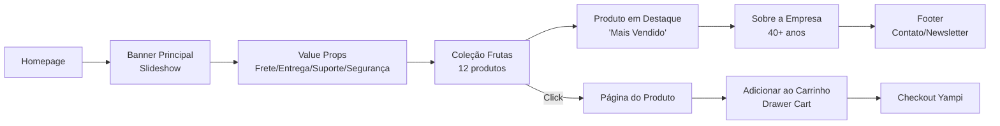

# 🔍 DOC-003 — Análise do E-commerce Atual — Raminho Importadora

| Metadado | Detalhe |
|---|---|
| **Nº do Documento** | DOC-003 |
| **Versão** | 1.0 |
| **Data de criação** | 26/02/2026 |
| **Última atualização** | 26/02/2026 |
| **Autor** | Equipe de Estratégia |
| **Documentos relacionados** | [DOC-001 — Persona & Público-Alvo](./persona_publico_alvo.md) · [DOC-002 — Identidade Visual](./identidade_visual_rebranding.md) |

> **URL:** [raminhoimportadora.com](https://raminhoimportadora.com/)  
> **Plataforma:** Shopify (tema customizado em Liquid)  
> **Checkout:** Yampi

---

## 1. Visão Geral do Site


| Item | Detalhe |
|---|---|
| **Plataforma** | Shopify |
| **Tema** | Tema customizado (Vision-based) |
| **Checkout** | Yampi (plugin integrado) |
| **Linguagem** | Liquid + jQuery 3.6.0 |
| **CSS Principal** | `theme.min.css` (193KB) |
| **JS Principal** | `theme.min.js` (410KB) |
| **Fontes** | Poppins (400, 700) + Font Awesome |
| **Categorias** | 3 — Frutas, Verduras/Legumes, Produtos Naturais/Empório |
| **Total de produtos** | 145+ |
| **Carrinho** | Drawer (mini-cart lateral) |

---

## 2. Estrutura do Tema Liquid

### Arquitetura de Arquivos

```
theme/
├── assets/          → 43 arquivos (CSS, JS, imagens, fontes)
├── config/          → 3 arquivos (settings_data.json, settings_schema.json, markets.json)
├── layout/          → 3 arquivos (theme.liquid, password.liquid, gift-card.liquid)
├── locales/         → 8 arquivos (traduções)
├── sections/        → 61 arquivos (componentes de página)
├── snippets/        → 43 arquivos (partials reutilizáveis)
└── templates/       → 28 arquivos (JSON templates + customers/)
```

### Seções Principais (61 seções)

| Seção | Arquivo | Tamanho | Status |
|---|---|---|---|
| **Header** | `header.liquid` | 44KB | ✅ Ativo |
| **Footer** | `footer.liquid` | 49KB | ✅ Ativo |
| **Carrinho** | `main-cart.liquid` | 59KB | ✅ Ativo |
| **Coleção** | `main-collection.liquid` | 56KB | ✅ Ativo |
| **Produto** | `main-product.liquid` | 50KB | ✅ Ativo |
| **Busca** | `main-search.liquid` | 51KB | ✅ Ativo |
| **Promoção** | `promo_active.liquid` | 31KB | ✅ Ativo |
| **Blog** | `main-blog.liquid` | 20KB | ✅ Ativo |
| **Reviews** | `areviews-section.liquid` | 2.7KB | ❌ Desabilitado |
| **Recomendações** | `product-recommendations.liquid` | 4.4KB | ❌ Desabilitado |
| **Vistos Recentemente** | `recently-viewed-products.liquid` | 3.5KB | ❌ Desabilitado |
| **Lista de Coleções** | `collection-list.liquid` | 5.2KB | ❌ Desabilitado na Home |

### Snippets Importantes (43 snippets)

| Snippet | Função | Observação |
|---|---|---|
| `product-item.liquid` | Card de produto | 21KB — customizado |
| `product-buy-buttons.liquid` | Botões de compra | 19KB |
| `mini-cart.liquid` | Carrinho drawer | 27KB |
| `visionparcelamento.liquid` | Tabela de parcelamento | 43KB — muito grande |
| `YampiSnippet.liquid` | Checkout Yampi | 17KB |
| `css-variables.liquid` | Variáveis CSS | 21KB — todas as cores do tema |
| `kitsvision.liquid` | Kits de produtos | 11KB |
| `stickyvision.liquid` | Elementos fixos | 4KB |

---

## 3. Fluxo do Usuário (Customer Journey)

### Homepage → Produto → Compra



### Pontos de Atrito no Fluxo

| Ponto | Problema | Impacto na Conversão |
|---|---|---|
| **1. Banner Principal** | Apenas 1 slide configurado, sem variedade | 🔴 Não retém atenção |
| **2. Produto Mais Vendido** | Produto "Morango Hidropônico" não carrega imagem | 🔴 Quebra de confiança |
| **3. Recomendações** | Seção **desabilitada** — sem cross-sell | 🔴 Perde ticket médio |
| **4. Reviews** | Seção de avaliações **desabilitada** | 🔴 Sem prova social |
| **5. Vistos Recentemente** | **Desabilitado** — sem reengajamento | 🟡 Perde retorno |
| **6. Lista de Coleções** | **Desabilitada** na home — sem navegação visual | 🟡 Dificulta descoberta |
| **7. Frete Grátis** | Apenas acima de R$497 — barreira alta | 🔴 Abandono de carrinho |
| **8. Blog** | Existe mas sem conteúdo visível | 🟡 Perde SEO orgânico |

---

## 4. Análise das Templates de Produto

### Templates Disponíveis

| Template | Arquivo | Uso |
|---|---|---|
| **Padrão** | `product.json` | Template principal |
| **Morango** | `product.morango.json` | Template customizado para morango |
| **Contato** | `product.contact.json` | Produto com formulário |
| **Pré-venda** | `product.pre-order.json` | Produtos em pré-venda |
| **Quick View** | `product.quick-view.json` | Visualização rápida (modal) |

### Análise: `product.json`

**Seções ativas na página de produto:**
1. ✅ Produto principal (galeria + info + botão comprar)
2. ✅ Texto de aviso sobre fotos IA
3. ❌ Recomendações — **Desabilitado**
4. ❌ Vistos Recentemente — **Desabilitado**
5. ❌ Lista de coleções — **Desabilitado**
6. ❌ Reviews — **Desabilitado**
7. ✅ Coleção "Frutas" (12 produtos)
8. ✅ Coleção "Legumes e Verduras" (12 produtos)

> ⚠️ **Problema grave:** O aviso sobre fotos IA está no template do produto: *"Algumas fotos podem utilizar recursos visuais assistidos por tecnologia (IA) para destacar detalhes do produto."* — Isso diminui a confiança do consumidor.

---

## 5. Página de Carrinho

**Funcionalidades do Carrinho:**

| Feature | Status | Observação |
|---|---|---|
| Notas do pedido | ❌ Desabilitado | `enable_order_notes: false` |
| Embrulho para presente | ✅ Configurado | Texto: "Embrulhar para Presente?" |
| Bandeiras de pagamento | ✅ Ativo | Visa, Master, Elo, etc. |
| Estimativa de frete | ✅ Ativo | Calculadora no carrinho |
| Upsell | ✅ Configurado | "Aproveite e leve também" — coleção geral |
| Promoções da Semana | ✅ Ativo | 12 produtos da coleção completa |
| Vistos Recentemente | ✅ Ativo no carrinho | — |
| Trust badges | ✅ Ativo | Entrega, satisfação, suporte, segurança |

> O carrinho é **a página mais bem configurada** do site — tem upsell, trust badges e promoções.

---

## 6. Análise Técnica de Performance

### Problemas Identificados

| Problema | Detalhes | Impacto |
|---|---|---|
| **jQuery externo** | Carrega jQuery 3.6.0 via CDN (code.jquery.com) + 2 cópias locais | 🔴 Performance redundante |
| **JS não minificado** | `jquery.js` (87KB) + `jquery.min.js` (89KB) — ambos no assets | 🟡 Peso desnecessário |
| **CSS pesado** | `theme.css` (235KB) + `theme.min.css` (193KB) — ambos presentes | 🟡 Pode estar carregando duplicado |
| **Parcelamento CSS** | `parcelamento.min.css` (184KB) — enorme para um componente | 🔴 Bloqueio de renderização |
| **Font Awesome completo** | 3 arquivos woff2 (136KB + 24KB + 137KB) — carrega a biblioteca inteira | 🟡 Usar apenas ícones necessários |
| **Bloqueadores** | Scripts que bloqueiam F12, botão direito e seleção de texto | 🔴 Péssima UX, não impede nada |
| **Ionicons** | Carrega biblioteca inteira via CDN externo (unpkg.com) | 🟡 Dependência externa |

### Scripts de Bloqueio (Anti-UX)

O tema inclui opções para:
- ❌ Bloquear clique direito (`botao_direito_enable`)
- ❌ Bloquear F12/DevTools (`atalho_f12_enable`)
- ❌ Bloquear seleção de texto (`selecionar_conteudo_enable`)
- ❌ "Ali Hunter" blocker (`ali_hunter_enable`)

> **Recomendação:** Remover todos. Não impedem nada, irritam o usuário e prejudicam acessibilidade.

---

## 7. SEO & Metadados

| Item | Status | Observação |
|---|---|---|
| **Title tag** | ✅ Dinâmico | `{{ seo_page_title }}` |
| **Meta description** | ✅ Presente | Descrição OG configurada |
| **Canonical URL** | ✅ Configurado | `{{ canonical_url }}` |
| **Open Graph** | ✅ Via snippet | `social-meta-tags.liquid` |
| **Microdata/Schema** | ✅ Presente | `microdata-schema.liquid` (7KB) |
| **Blog/Conteúdo** | ⚠️ Inativo | Blog existe mas sem artigos visíveis |
| **Sitemap** | ✅ Automático Shopify | |
| **Alt tags** | ⚠️ Parcial | Algumas imagens sem alt descritivo |

---

## 8. Integrações & Apps

| Integração | Status | Detalhes |
|---|---|---|
| **Yampi Checkout** | ✅ Ativo | Checkout customizado via snippet |
| **Ali Reviews** | ⚠️ Desabilitado | App instalado mas seção desativada |
| **Font Awesome** | ✅ Ativo | Ícones do site |
| **Ionicons** | ✅ Ativo | Ícones adicionais |
| **Google Fonts** | ✅ Ativo | Poppins via Shopify |
| **WhatsApp** | ✅ Ativo | Botão flutuante + header + footer |
| **Selos de segurança** | ✅ Ativo | Google, Reclame Aqui, Norton/SSL |

---

## 9. Funcionalidades Configuradas vs Desativadas

### ✅ ATIVAS
- Slideshow (1 slide)
- Value Props (4 ícones)
- Coleção em destaque (Frutas)
- Produto em destaque
- Imagem com texto (sobre)
- Mini-cart drawer
- Cálculo de frete
- WhatsApp flutuante
- Newsletter no footer
- Parcelamento em 4x
- Popup de frete grátis
- Barra de navegação animada
- Embrulho para presente

### ❌ DESATIVADAS (oportunidades perdidas)
- **Reviews/Avaliações** — Prova social
- **Produtos recomendados** — Cross-sell automático
- **Vistos recentemente** (na home/produto) — Reengajamento
- **Lista de coleções** na home — Navegação visual
- **Cronômetro de escassez** — Urgência
- **Barra de progresso de estoque** — Escassez visual
- **Pix com desconto** — Incentivo ao pagamento à vista
- **Blog** — SEO e conteúdo
- **FAQ** — Template existe mas sem uso visível
- **Timer de produto** — Promoções com tempo limitado

---

## 10. Diagnóstico & Recomendações Prioritárias

### 🔴 Crítico (Fazer AGORA)

| # | Ação | Justificativa |
|---|---|---|
| 1 | **Ativar Reviews/Avaliações** | Prova social = aumento de 15-30% na conversão |
| 2 | **Ativar Recomendações de produto** | Cross-sell = aumento de ticket médio |
| 3 | **Corrigir "Produto Mais Vendido"** na home | Produto sem imagem = confiança quebrada |
| 4 | **Substituir fotos IA por fotos reais** | Remover aviso de IA e ganhar credibilidade |
| 5 | **Remover scripts de bloqueio** (F12, clique direito) | Anti-UX, prejudica acessibilidade |

### 🟡 Importante (Próximas 2 semanas)

| # | Ação | Justificativa |
|---|---|---|
| 6 | **Adicionar mais slides no banner** | Variedade de promoções e categorias |
| 7 | **Ativar "Vistos Recentemente"** | Reengajamento do usuário |
| 8 | **Ativar Lista de Coleções** na home | Navegação visual por categoria |
| 9 | **Reduzir frete grátis** para R$200-250 | Diminuir abandono de carrinho |
| 10 | **Limpar assets duplicados** | jQuery duplicado, CSS duplicado |

### 🟢 Melhoria (Próximo mês)

| # | Ação | Justificativa |
|---|---|---|
| 11 | **Criar conteúdo de blog** | SEO orgânico |
| 12 | **Ativar desconto PIX** | Incentivo a pagamento instantâneo |
| 13 | **Criar programa de assinatura** | Recorrência |
| 14 | **Otimizar Font Awesome** | Carregar apenas ícones usados |
| 15 | **Criar cestas presenteáveis** | Nova categoria de alto valor |

---

## 11. Resumo Executivo

> A Raminho Importadora possui um e-commerce funcional, mas **operando a 40% do seu potencial**. O tema Liquid é robusto e possui diversas funcionalidades prontas que estão **desativadas** — reviews, recomendações, vistos recentemente, desconto PIX, e lista de coleções.
>
> Os **maiores problemas** são: falta de prova social (reviews desativados), fotos de produtos geradas por IA que diminuem confiança, seções quebradas na homepage, e barreira alta de frete grátis (R$497).
>
> A **maior oportunidade** está em **ativar funcionalidades que já existem** no tema — sem precisar desenvolver nada novo. Apenas ativando reviews, recomendações e corrigindo a home, o impacto estimado na conversão é de **+20-40%**.

---

## 12. Números & Dados do E-commerce (📊 Atualização Contínua)

> ⚠️ **Seção em construção** — Preencher conforme dados forem coletados do Shopify, Google Analytics e campanhas.

### 12.1 Números do Catálogo (Baseline — 26/02/2026)

| Métrica | Valor | Observação |
|---|---|---|
| **Total de produtos** | 145+ | 41 frutas + 32 verduras/legumes + 72 empório |
| **Faixa de preço (Frutas)** | R$9,59 – R$64,99 | Limão siciliano – Kiwi amarelo |
| **Faixa de preço (Verduras)** | R$5,04 – R$29,88 | Mandioca – Alcachofra |
| **Faixa de preço (Empório)** | R$7,47 – R$114,44 | Ameixa – Castanha-do-Pará |
| **Parcelamento** | Até 4x sem juros | Via Yampi |
| **Frete grátis** | Acima de R$497 | Apenas Grande SP |
| **Formas de pagamento** | Cartão (Visa, Master, Elo, Amex, Hiper, Discover), PIX | Boleto desabilitado |

### 12.2 Patrimônio Digital Atual

| Ativo | Valor |
|---|---|
| **Seções Liquid ativas** | 13 de 61 possíveis (21%) |
| **Features desativadas** | 10 funcionalidades prontas não utilizadas |
| **Templates de produto** | 5 variantes configuradas |
| **Peso total de assets** | ~1.6MB (CSS+JS+Fontes) |
| **Idade do domínio** | 40+ anos de marca, domínio ativo |
| **Selos de confiança** | Google Safe, Reclame Aqui, SSL |

### 12.3 Dados de Tráfego & Conversão

| Métrica | Valor | Fonte | Data |
|---|---|---|---|
| **Sessões mensais** | *Aguardando dados* | Google Analytics | — |
| **Usuários únicos** | *Aguardando dados* | GA | — |
| **Bounce rate** | *Aguardando dados* | GA | — |
| **Páginas por sessão** | *Aguardando dados* | GA | — |
| **Tempo médio no site** | *Aguardando dados* | GA | — |
| **Taxa de conversão** | *Aguardando dados* | Shopify | — |
| **Abandono de carrinho** | *Aguardando dados* | Shopify | — |
| **Pedidos mensais** | *Aguardando dados* | Shopify | — |
| **Ticket médio** | *Aguardando dados* | Shopify | — |
| **Receita mensal** | *Aguardando dados* | Shopify | — |

### 12.4 Dados de Campanhas (Histórico)

| # | Campanha | Canal | Período | Investimento | Impressões | Cliques | CTR | CPC | Conversões | CPA | ROAS |
|---|---|---|---|---|---|---|---|---|---|---|---|
| 1 | *—* | *—* | *—* | *R$—* | *—* | *—* | *—%* | *R$—* | *—* | *R$—* | *—x* |

### 12.5 Evolução Mensal (Tracking)

| Mês | Sessões | Pedidos | Receita | Ticket Médio | Conversão | CAC |
|---|---|---|---|---|---|---|
| Fev/2026 | *—* | *—* | *R$—* | *R$—* | *—%* | *R$—* |
| Mar/2026 | *—* | *—* | *R$—* | *R$—* | *—%* | *R$—* |
| Abr/2026 | *—* | *—* | *R$—* | *R$—* | *—%* | *R$—* |
| Mai/2026 | *—* | *—* | *R$—* | *R$—* | *—%* | *R$—* |
| Jun/2026 | *—* | *—* | *R$—* | *R$—* | *—%* | *R$—* |
